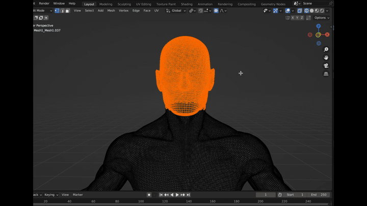
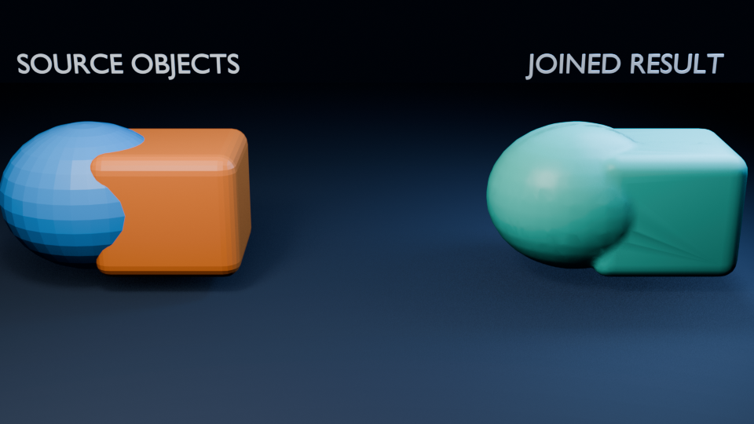

# Object Joiner for Blender

[](https://github.com/bgivenb/Blender-Object-Joiner/actions/workflows/test.yml)

A Blender add-on for combining selected meshes while preserving the originals. **Sculpting remesh** fuses overlapping geometry, shrinkwraps toward the source surface, and reduces polygons. **Join only** combines the evaluated geometry without rebuilding topology, retaining its UV layers and material assignments.

<a href="https://www.reddit.com/r/blender/comments/1gq8xs4/i_made_a_free_plugin_to_join_multiple_meshes/"></a>

*Excerpt from the original Blender walkthrough. [Watch the complete demo on r/blender](https://www.reddit.com/r/blender/comments/1gq8xs4/i_made_a_free_plugin_to_join_multiple_meshes/) or read the [design discussion](https://www.reddit.com/r/blender/comments/1gq8f3s/i_made_a_free_blender_addon_for_merging_meshes/).*

### Current reproducible example



## Design

- **Non-destructive:** processing happens on evaluated copies in a dedicated result collection. Visible modifiers from every source are baked at the current frame; source modifier stacks are untouched.
- **Transform-aware:** copies are converted to world-space geometry with unit scale before processing, including mirrored transforms.
- **Bounded controls:** voxel size and decimation ratio are validated before Blender begins expensive work.
- **Measurable:** each result records the source object count and before/after polygon counts as custom properties; Blender also reports the percentage change.
- **Recoverable:** **Restore Originals** restores the previous viewport and render visibility rather than making every source renderable.
- **Failure-aware:** partial objects and unused generated meshes are removed; source selection, active object, and visibility are restored on failure.

## Install

1. Download the add-on ZIP and matching `.sha256` file from the [latest release](https://github.com/bgivenb/Blender-Object-Joiner/releases/latest).
2. Verify the archive against the published SHA-256 checksum.
3. In Blender 3.6 or newer, open **Edit → Preferences → Add-ons → Install** and select the downloaded ZIP.
4. Enable **Object Joiner**.
5. Open the 3D Viewport sidebar (`N`) and choose **Object Joiner**.

To build the same installable archive from a source checkout, run `python scripts/package_addon.py`; the ZIP and checksum are written to `dist/`.

## Use

In Object Mode, select at least two mesh objects and choose a mode. For **Sculpting remesh**, set voxel size and decimation ratio, then click **Build Joined Mesh**. Smaller voxels preserve more detail but cost substantially more time and memory. Voxel size is measured in world-space Blender units; start with `0.05` and refine for scene scale.

Choose **Join only** when you need one object without fusing surfaces or changing evaluated topology. All modes bake visible modifiers at the current frame; the result is a static mesh, not a preserved rig or shape-key animation. Remeshing rebuilds topology and should not be used to preserve UV layouts or precise material boundaries. Separate, non-overlapping components may remain disconnected.

The originals remain intact. With **Hide original objects** enabled, use **Restore Originals** to return their prior visibility in the current view layer. Polygon counts compare evaluated sources with the result, so adding a modifier to an input is reflected in the report.

## Development

Run the dependency-free tests:

```bash
python -m unittest discover -s tests -v
```

Run host integration tests for modifiers, transforms, UV/material retention, visibility, and failure cleanup:

```bash
blender --background --factory-startup --python-exit-code 1 --python tests/blender_integration.py
```

Rebuild the checked-in example image:

```bash
blender --background --python scripts/render_example.py
```

Build and checksum the installable add-on archive with:

```bash
python scripts/package_addon.py
blender --background --factory-startup --python-exit-code 1 --python scripts/verify_package.py
```

Version 2.1 was tested locally with Blender 4.5.11 LTS. CI also tests Ubuntu 24.04's Blender package and prints its version. [Changes in 2.1](CHANGELOG.md).

## Scope

This is an independent hobby project. Always keep a saved copy of important Blender work before running geometry operations.

## License

[CC0 1.0 Universal](LICENSE)
